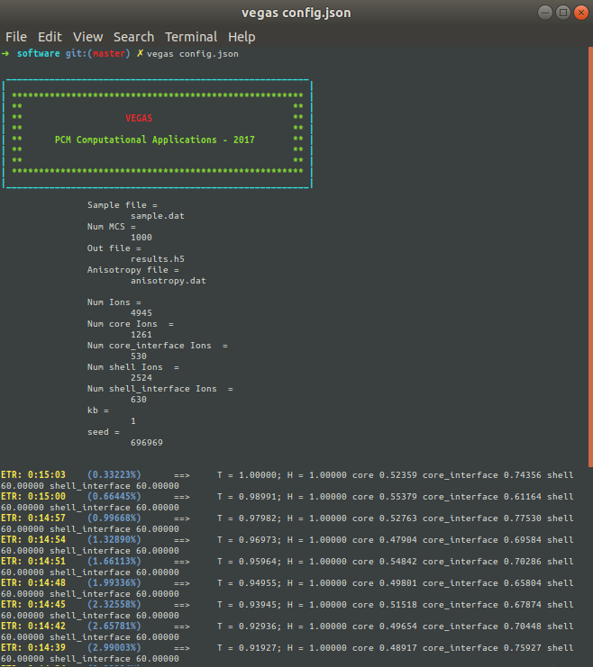
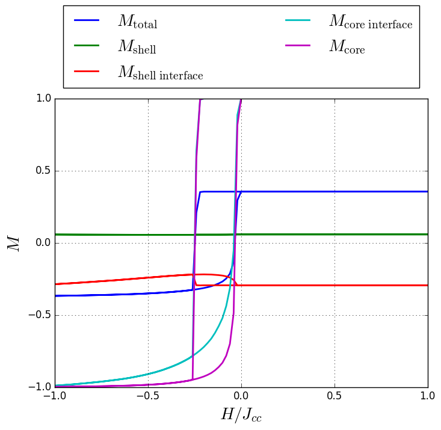
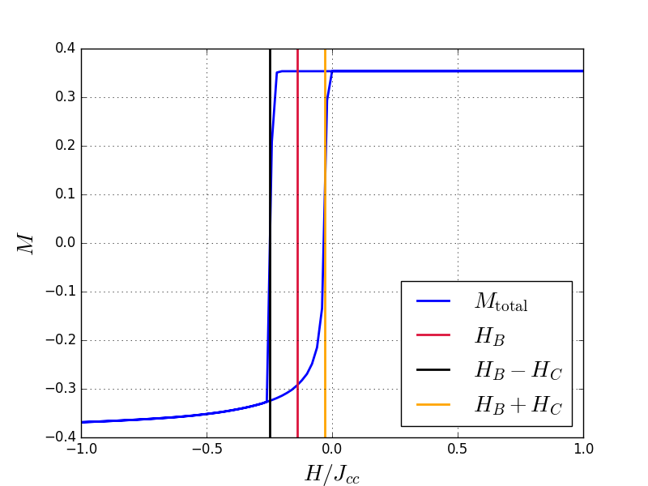

# Ciclos de histéresis para nanopartículas core/shell

## Construcción de la nanopartícula core/shell (build_sample.py)

Vamos a construir una nanopartícula core/shell con estructura cúbica simple usando un script de python.

Primero que todo, debemos incluir las librerías necesarias:

```python
import numpy
from itertools import product
from matplotlib import pyplot
from collections import defaultdict
```

Ahora, definimos los valores del radio del core  y de la nanopartícula  medidos en celdas unitarias.

```python
Rc = 7.5
R = 10.5
```

Definimos el valor del espín para el core  y para el shell . Así mismo, debemos definir el valor de las constantes de anisotropía para el core  y para el shell  y los valores de las constantes de intercambio entre core-core , core-shell  y shell-shell . Por otra parte, debemos definir la [política de actualización](https://pcm-ca.github.io/vegas/spin-update-policies/) para la dirección de los momentos magnéticos.

```python
ss = sc = 1.0
jcc = 1.0
kc = 0.1 * jcc
ks = 0.5 * jcc
jint = -0.5 * jcc
jss = -0.5 * jcc
update_policy = "adaptive"
```

Creamos diccionarios para fácilmente devolver los parámetros anteriormente definidos:

```python
spin = {
    "core": sc,
    "core_interface": sc,
    "shell": ss,
    "shell_interface": ss,
       }

kan = {
    "core": kc,
    "core_interface": kc,
    "shell": ks,
    "shell_interface": ks,
      }

jex = {
    ("core", "core"): jcc,
    ("core", "shell"): jint,
    ("shell", "core"): jint,
    ("shell", "shell"): jss
      }
```

Ahora, creamos la lista de sitios y los identificamos como iones del core o del shell de acuerdo a :

```python
sites = list()
core_sites = list()
shell_sites = list()
for site in product(range(-int(numpy.ceil(R+1)), int(numpy.ceil(R+1))),
                    range(-int(numpy.ceil(R+1)), int(numpy.ceil(R+1))),
                    range(-int(numpy.ceil(R+1)), int(numpy.ceil(R+1)))):
    dist = numpy.linalg.norm(site)
    if dist <= R:
        sites.append(site)
        if dist <= Rc:
            core_sites.append(site)
        else:
            shell_sites.append(site)
```

Convertimos las listas anteriores a arreglos de ```numpy``` para producir un corte transversal para :

```python
all_positions = numpy.array(sites)
core_positions = numpy.array(core_sites)
shell_positions = numpy.array(shell_sites)
core_positions = core_positions[core_positions[:, 1] == 0]
shell_positions = shell_positions[shell_positions[:, 1] == 0]
```

Generamos una gráfica del sección transversal usando diferente colores para los iones del core y del shell:

```python
pyplot.figure(figsize=(8, 8))
pyplot.scatter(core_positions[:, 0], core_positions[:, 2], s=100, color="silver", edgecolor="black")
pyplot.scatter(shell_positions[:, 0], shell_positions[:, 2], s=150, color="gray", edgecolor="black")
pyplot.grid()
pyplot.xlabel(r"$x$", fontsize=20)
pyplot.ylabel(r"$z$", fontsize=20)
pyplot.xlim(-R-1, R+1)
pyplot.ylim(-R-1, R+1)
pyplot.gca().set_aspect("equal")
pyplot.show()
```


Identificamos los vecinos de cada sitio y los almacenamos en un diccionario:

```python
nhbs = defaultdict(list)
for site in sites:
    x, y, z = site
    for dx, dy, dz in [(1, 0, 0), (-1, 0, 0),
                       (0, 1, 0), (0, -1, 0),
                       (0, 0, 1), (0, 0, -1)]:
        nhb = ((x + dx), (y + dy), (z + dz))
        if nhb in sites:
            nhbs[site].append(nhb)
```

Podemos realizar algunas verificaciones. Cada sitio debe tener como máximo 6 vecinos y debe estar a una distancia de 1.0 de cada uno de ellos:

```python
for site in sites:
    assert len(nhbs[site]) <= 6
    for nhb in nhbs[site]:
        assert numpy.linalg.norm(numpy.array(site) - numpy.array(nhb)) == 1.0
        assert site in nhbs[nhb]
```

Ahora, creamos un diccionario para identifica el tipo de cada sitio, el cual puede ser ```core```, ```shell```, ```core_interface``` o ```shell_interface```, los cuales corresponde a los sitios localizados en el core, el shell, la interfaz del core y la interfaz del shell, respectivamente:

```python
types = dict()
for site in sites:
    prefix = "core" if site in core_sites else "shell"
    for nhb in nhbs[site]:
        nhb_prefix = "core" if nhb in core_sites else "shell"
        if prefix != nhb_prefix:
            prefix += "_interface"
            break
    types[site] = prefix
```

Creamos un diccionario para almacenas todos los sitios de cada tipo:

```python
positions = defaultdict(list)
for site in sites:
    positions[types[site]].append(site)
```

Verificamos que sólo hay cuatro tipo de iones:

```python
print(positions.keys())
```

```python
dict_keys(['core_interface', 'core', 'shell', 'shell_interface'])
```

De nuevo, convertimos la lista de sitios a arreglos de nu py para poder generar un gráfico de un corte transversal para :

```python
core = numpy.array(positions["core"])
shell = numpy.array(positions["shell"])
core_interface = numpy.array(positions["core_interface"])
shell_interface = numpy.array(positions["shell_interface"])
core = core[core[:, 1] == 0]
shell = shell[shell[:, 1] == 0]
core_interface = core_interface[core_interface[:, 1] == 0]
shell_interface = shell_interface[shell_interface[:, 1] == 0]
```

Generamos un gráfico de la sección transversal usando diferentes colores para las diferentes regiones:

```python
pyplot.figure(figsize=(8, 8))
pyplot.scatter(core[:, 0], core[:, 2], s=100, color="silver", edgecolor="black")
pyplot.scatter(shell[:, 0], shell[:, 2], s=150, color="gray", edgecolor="black")
pyplot.scatter(core_interface[:, 0], core_interface[:, 2], s=100, color="gold", edgecolor="black")
pyplot.scatter(shell_interface[:, 0], shell_interface[:, 2], s=150, color="red", edgecolor="black")
pyplot.grid()
pyplot.xlabel(r"$x$", fontsize=20)
pyplot.ylabel(r"$z$", fontsize=20)
pyplot.xlim(-R-1, R+1)
pyplot.ylim(-R-1, R+1)
pyplot.gca().set_aspect("equal")
pyplot.show()
```


Definimos la anisotropía y el campo magnético externo para cada sitio, los cuales van a ser iguales a la dirección z  para todos los iones:

```python
anisotropy_axis = dict()
field_axis = dict()
for site in sites:
    anisotropy_axis[site] = (0.0, 0.0, 1.0)
    field_axis[site] = (0.0, 0.0, 1.0)
```

Contamos el número de interacciones, la cual es igual a la suma de la cantidad de vecinos de cada sitio, y el número de iones, el cual es la longitud de la lista de sitios:

```python
num_interactions = 0
for site in sites:
    num_interactions += len(nhbs[site])
num_sites = len(sites)
```

Creamos los archivos para almacenar las propiedades estructurales (samples.dat) y la anisotropía (anisotropy.dat):

```python
sample_file = open("sample.dat", mode="w")
anisotropy_file = open("anisotropy.dat", mode="w")
```

Escribimos en la primera línea de **sample_file** el número de sitios, interacciones y tipos:

```python
sample_file.write("{} {} {}\n".format(num_sites, num_interactions, len(set(types.values()))))
print(num_sites, num_interactions, len(set(types.values())))
```

```
4945 27576 4
```

Escribimos el tipo de los iones, uno en una línea diferente:

```python
for t in sorted(set(types.values())):
    sample_file.write("{}\n".format(t))
    print(t)
```

```
core
core_interface
shell
shell_interface
```

Escribimos los parámetros de cada sitio de acuerdo al [formato](https://pcm-ca.github.io/vegas/system-building/) establecido por **Vegas**:

```python
for site in sites:
    i = sites.index(site)
    t = types[site]
    sample_file.write("{} {} {} {} {} {} {} {} {} {}\n".format(i, *site, spin[t], *field_axis[site], t, update_policy))
    anisotropy_file.write("{} {} {} {}\n".format(*anisotropy_axis[site], kan[t]))
```

Escribimos las interacciones de intercambio entre cada par de vecinos:

```python
for site in sites:
    t = types[site]
    for nhb in nhbs[site]:
        nhb_t = types[nhb]
        sample_file.write("{} {} {}\n".format(
            sites.index(site), sites.index(nhb),
            jex[(t.split("_")[0], nhb_t.split("_")[0])]))
```

Cerramos los archivos:

```python
sample_file.close()
anisotropy_file.close()
```

## Archivo de configuración (config.py)

Para hacer una simulación para el estudio de propiedades histeréticas de este tipo de sistemas, es necesario enfriar inicialmente la muestra en presencia de un campo magnético y luego hacer el ciclo de histéresis. **vegas** permite pasar listas para las propiedades *field* y *temperature*. Con esto en mente, vamos a hacer un script de python para generar el archivo ```config.json```. Inicialmente, generamos un arreglo de temperaturas (**temps**) y campos (**fields**). Luego, generamos los valores para el enfriamiento:


```python
import numpy

temps = []
fields = []
for T in numpy.linspace(1.0, 0.001, 100):
    temps.append(T)
    fields.append(1.0)
```

Ahora, creamos los valores para el ciclo de histéresis:

```python
for H in numpy.linspace(1, -1, 100, endpoint=False):
    fields.append(H)
    temps.append(temps[-1])

for H in numpy.linspace(-1, 1, 101):
    fields.append(H)
    temps.append(temps[-1])
```

Finalmente, creamos un diccionario con los parámetros:

```python
params = {
    "sample": "sample.dat",
    "anisotropy": "anisotropy.dat",
    "out": "results.h5",
    "kb": 1.0,
    "mcs": 10000,
    "seed": 696969,
    "field": fields,
    "temperature": temps
}
```

y almacenamos el diccionarios **params** en un archivo json:

```python
import json
json.dump(params, open("config.json", mode="w"))
```

## Ejecutando **vegas**

Ahora, ejecutamos desde la consola vegas:

```bash
vegas config.json
```

Un mensaje como este debe aparecer:



Una vez la simulación esté completa, el archivo **results.h5** es generado. Este archivo contiene toda la historia de la simulación.

## Análisis de resultados (analyzer.py)

Importamos las librerías requeridas:

```python
import numpy
import h5py
from matplotlib import pyplot
from collections import Counter
```

Cargamos la el archivo de resultados (**results.h5**) dentro de una estructura llamada **dataset**:

```python
dataset = h5py.File("results.h5", mode="r")
```

Si *casteamos* **dataset** a una lista, será devuelto el conjunto de variables:

```python
print(list(dataset))
```

```
['core_interface_x', 'core_interface_y', 'core_interface_z', 'core_x', 'core_y', 'core_z', 'energy', 'field', 'finalstates', 'magnetization_x', 'magnetization_y', 'magnetization_z', 'positions', 'shell_interface_x', 'shell_interface_y', 'shell_interface_z', 'shell_x', 'shell_y', 'shell_z', 'temperature', 'types']
```

Además, podemos obtener el número de pasos Monte Carlo (**mcs**) usando el diccionario de atributos.

```python
mcs = dataset.attrs.get("mcs")
```

Cargamos los tipos de iones para cada sitio y los contamos. Esto con el fin de calcular la magnetización por tipo:

```python
types = [t.decode() for t in dataset.get("types")]
num_types = Counter(types)
```

Imprimimos el diccionario **num_types** para observar el número de iones por tipo:

```python
print(num_types)
```

```python
Counter({'shell': 2524, 'core': 1261, 'shell_interface': 630, 'core_interface': 530})
```

Cargamos los arreglos de temperaturas y campos. Sin embargo, podemos despreciar los primeros 100 puntos, debido a que estos son los puntos del enfriamiento:

```python
temperatures = dataset.get("temperature")[100:]
fields = dataset.get("field")[100:]
```

Además, cargamos la magnetización total en z junto con la magnetización en z para cada tipo de iones. Esto es posible por medio de la variable ```type_z``` donde ```type``` es el tipo. Es decir, ```dataset.get("core_z")``` es la magnetización de los iones con tipo ```core``` en la dirección z.

```python
mag_z = dataset.get("magnetization_z")[100:, mcs//2:]
mag_z_by_type = {t: dataset.get("%s_z" % t)[100:, mcs//2:] for t in num_types}
```

Es posible aprecias en las lineas anteriores que despreciamos los primeros 100 puntos de campo/temperatura debido a que son los pasos del enfriamiento (no importantes acá) y la mitad de los pasos Monte Carlo para la relajación.

Computamos los promedios de las magnetizaciones cada 10 pasos Monte Carlo:

```python
mag_mean = numpy.mean(mag_z[:, ::10], axis=1) / numpy.sum(list(num_types.values()))
mag_mean_by_type = {t:  numpy.mean(
    mag_z_by_type[t][:, ::10], axis=1) / num_types[t] for t in num_types}
```

Graficamos la magnetización media por tipo como función del campo magnético.

```python
pyplot.figure(figsize=(8, 6))
pyplot.plot(fields, mag_mean, label=r"$M_{\rm total}$", lw=2)
for t, mag in mag_mean_by_type.items():
    pyplot.plot(fields, mag, label=r"$M_{\rm %s}$" % t.replace("_", "\ "), lw=2)

pyplot.xlabel(r"$H / J_{cc}$", fontsize=20)
pyplot.ylabel(r"$M$", fontsize=20)
pyplot.xlim(min(fields), max(fields))
pyplot.grid()
lgd1 = pyplot.legend(loc=9, fontsize=20,
              bbox_to_anchor=(0.0, 0.35, 1, 1), ncol=2, mode="expand")
pyplot.savefig("M_vs_H.png", bbox_extra_artists=(lgd1, ), bbox_inches='tight')
pyplot.close()
```




Computamos los interceptos con el eje del campo para calcular el campo coercitivo y el campo bias. Estos interceptos son calculados como el punto medio entre los puntos donde la magnetización cambia de signo. Estos interceptos no están centrados en , indicanto que la ocurrencia de *exchange bias*:

```python
intercepts = list()
for i in range(len(fields) - 1):
    if numpy.sign(mag_mean[i]) != numpy.sign(mag_mean[i + 1]):
        intercepts.append((fields[i] + fields[i + 1]) * 0.5)
print(intercepts)
```

```
[-0.25, -0.03]
```

Calculamos el campo bias (**Hb**) y el campo coercitivo (**Hc**):

```python
Hb = (intercepts[0] + intercepts[1]) * 0.5
Hc = numpy.abs(intercepts[0] - intercepts[1]) * 0.5
print(Hc, Hb)
```

```
0.11 -0.14
```

Finalmente, graficamos los ciclos de histéresis para la magnetización total indicando los valores ```Hb```, ```Hb + Hc``` y ```Hb - Hc```:

```python
pyplot.figure(figsize=(8, 6))
pyplot.plot(fields, mag_mean, label=r"$M_{\rm total}$", lw=2)
pyplot.axvline(Hb, color="crimson", lw=2, label=r"$H_{B}$")
pyplot.axvline(Hb - Hc, color="black", lw=2, label=r"$H_{B} - H_{C}$")
pyplot.axvline(Hb + Hc, color="orange", lw=2, label=r"$H_{B} + H_{C}$")
pyplot.xlabel(r"$H / J_{cc}$", fontsize=20)
pyplot.ylabel(r"$M$", fontsize=20)
pyplot.xlim(min(fields), max(fields))
pyplot.grid()
pyplot.legend(loc=4, fontsize=20)
pyplot.savefig("M_vs_H_lines.png")
pyplot.close()
```

